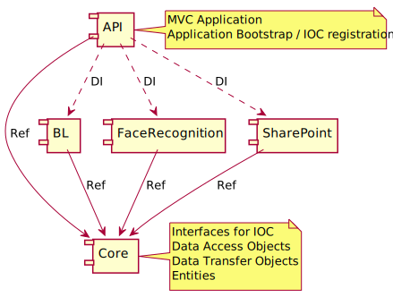

<h1><b>Studio Receptionist</b></h1>

# TOC

<!-- TOC -->

- [TOC](#toc)
- [Contributors guide](#contributors-guide)
    - [Prerequisits](#prerequisits)
    - [Create a local dev environment](#create-a-local-dev-environment)
    - [Run the project](#run-the-project)
    - [Project and solution structure](#project-and-solution-structure)
        - [Capgemini.StudioReceptionist.UI](#capgeministudioreceptionistui)
            - [Project structure](#project-structure)
            - [NPM commands](#npm-commands)
            - [Concepts](#concepts)
                - [Environments](#environments)
                - [Configuration](#configuration)
                - [SASS and styles](#sass-and-styles)
        - [Capgemini.StudioReceptionist Backend](#capgeministudioreceptionist-backend)
            - [Solution Structure](#solution-structure)
    - [Build process](#build-process)
    - [Unit testing vs. integration testing](#unit-testing-vs-integration-testing)

<!-- /TOC -->

# Contributors guide

This guide contains all information to start development with the Studio Receptionist AI solution.

## Prerequisits

The following software should get installed:

* Visual Studio 2017 (with NodeJS development and ASP.NET Web Development)
* NodeJS (newest LTS version)

## Create a local dev environment

* clone the repository (TODO: link to repo url)
* Open StudioReceptionistAI.sln in visual studio
* Build

> You have maybe manually to trigger the "npm install" task in the StudioReceptionistAI.UI solution by right clicking on npm folder and choosing "Install missing NPM packages".

## Run the project

* open the project in Visual Studio
* ensure that StudioReceptionistAI.API is set as the startup project
* ensure that "Debug" is used as the build configuration
* run the project by pressing CTRL+F5B

> Under the hood, in Application_Start on Global.asax the application runs the "npm start" command on the UI project, so a second webserver (webpack-dev-server) is brought up. Application_Unload removes the running npm start process.
> TODO: Application_End does not throw down the process, current implementation does not work

After you started the project:

* the browser is brought up with 2 tabs, one with the UI project running and one with the API project running
* when you change a file in  the UI project, the browser tab will reload with your newest changes in it.

## Project and solution structure

The solution consists of the following projects:

* Capgemini.StudioReceptionist.UI - React Application
* Capgemini.StudioReceptionist.API - Web API Project
* Capgemini.StudioReceptionist.API.Tests -  Unit test project for Web API

### Capgemini.StudioReceptionist.UI

Frontend for the receptionist project.

Technologies:

* Typescript
* NPM
* Webpack
* React
* Babel

#### Project structure

> Main folder: Capgemini.StudioReceptionist.UI

* Folder ***src*** contains the react application
* Folder ***config*** contains several configurations like webpack
    * Folder **frontend**: Configurations per environment for the frontend
    * Folder **webpack**: Webpack Configurations per environment

#### NPM commands

Command | Description
--- | ---
`npm start` | Build app continuously (HMR enabled) and serve @ `http://localhost:8080`
`npm run start-prod` | Build app once (HMR disabled) and serve @ `http://localhost:3000`
`npm run build` | Build app to `/dist/`
`npm run test` | Run tests
`npm run lint` | Run Typescript and SASS linter
`npm run lint:ts` | Run Typescript linter
`npm run lint:sass` | Run SASS linter
`npm run start` | (alias of `npm run start-dev`)

#### Concepts

##### Environments

When building with webpack, we implemented several environments. Before the webpack build is start, an environment variable ENVIRONMENT can be set to determine the target build environment. For local development it is 'development' for example. In Typescript then you have a global variable ENV which contains these string, so you can differentiate the UI regarding to the build environment.

##### Configuration

In the folder configs/frontend you can find the frontend congigurations for the several environments. This config is made public to the typescript app over the global variable CONFIG (with the help of the Webpack Define Plugins).

If you want to add a configuration property, add the new property into the configuration json under configs/frontend and adjust IFrontendConfig interface in src/global.d.ts to make the new property visible in typescript.

##### SASS and styles

A sass processor is already implemented. You can use sass notation for writing scss files. You should read more about SASS [here](https://sass-lang.com/).

Use [BEM](http://getbem.com/introduction/) as naming convention in CSS will save your life, so use it! Once understood, finding CSS in your sass files will be very easy.

> Modules: Encapsulate the component css into sass modules as shown with the Application module. src/assets/scss/App.scss is used as the main entry point for the sass compiler.

### Capgemini.StudioReceptionist Backend

Backend Implementations for StudioReceptionist.

Technologies:

* ASP.NET MVC WebApi
* C# 4.7

#### Solution Structure

Notice the following things in picture above:

* All projects containing refernces to the Core library, which contains the IOC/DI interfaces, Data Transfer objects and common things needed in all assemblies.
* The BL project contains the service layer of the application and the business layer. All components which are used outside the assembly are implementing a interface in Core and are used with IOC mechanism in the API project.
* Then there are several functional assemblies which implementing interfaces too to get used from outside the assembly and registered and used with the IOC container in  the API project.
* The API project wraps all that up, by bootstrapping the IOC, register all components and implements the MVC specific things.

> IOC/DI is the base to get this structure. By using only the shared interfaces for the communication between the assemblies, and using IOC to hide the implementation behind it, the project folder of the solution avoids having reference roundtrips between them.

#### Concepts

##### Inversion of Control & Dependency Injection
IoC and DI are utilized to modularize the application. Through IoC and DI the application is reliant on interfaces rather than the actual classes. The sought after objects are then given/injected at run time. To pass the wanted object during runtime, the object has to be bound to respective compatible interfaces. In the applicaiton, this is done with the help of Autofac.

###### Autofac

With Autofac a "ContainerBuilder" can be defined which allows the binding of classes to interfaces. In the application this is done in a autofac configuration file in the Api project under App_Start. By binding components, the specified class will be instansiated whenever the specified interface is called. 

To initialize Autofac the configuration mentioned above needs to be initialized. This is also done in a class file in the App_Start folder. The Autofac configuration file includes an initialization method that registers the "ContainerBuilder". Autofac is in the application initialized in the Bootstrapper.cs which calls the Initialize method of the Autofac configuraiton file.

## Build process

## Unit testing vs. integration testing
